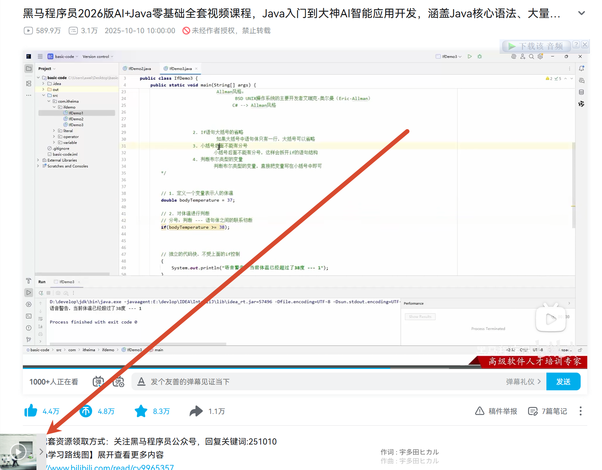

## 我用AI开发了一个B站合集视频的油猴脚本
下方是全部代码
```bash
    // ==UserScript==
// @name         音乐播放器（吸底模式）
// @namespace    http://tampermonkey.net/
// @version      3.0
// @description  在B站视频页添加吸底音乐播放器，无多余装饰
// @author       You
// @match        *://*.bilibili.com/video/*
// @require      https://cdn.jsdelivr.net/npm/aplayer@1.10.1/dist/APlayer.min.js
// @require      https://cdn.jsdelivr.net/npm/meting@2.0.1/dist/Meting.min.js
// @run-at       document-end
// @grant        GM_addElement
// ==/UserScript==

(function() {
    'use strict';

    // 1. 加载 APlayer 的 CSS（必须）
    GM_addElement('link', {
        rel: 'stylesheet',
        href: 'https://cdn.jsdelivr.net/npm/aplayer@1.10.1/dist/APlayer.min.css'
    });

    // 2. 延迟插入播放器（避开B站初始化高峰）
    setTimeout(() => {
        const meting = document.createElement('meting-js');
        meting.setAttribute('server', 'netease');
        meting.setAttribute('type', 'playlist');
        meting.setAttribute('id', '7297488308');  // 这里填入你的歌单ID
        meting.setAttribute('fixed', 'true');   // 启用吸底模式（关键）
        // 可选：meting.setAttribute('mini', 'true');  // 如果需要迷你模式（更小）
        document.body.appendChild(meting);
    }, 1500);
})();
```    
## 使用效果

这个脚本在左下角，显示了一个音乐播放器，剩余多长时间，如果有bug可以告诉我，我在修改一下

## 参考文档
- [APlayer](https://aplayer.js.org/#/)
- [Meting](https://github.com/metowolf/MetingJS)
- [学不会xuebuhui](https://www.cnblogs.com/codedingzhen/p/17849752.html)
