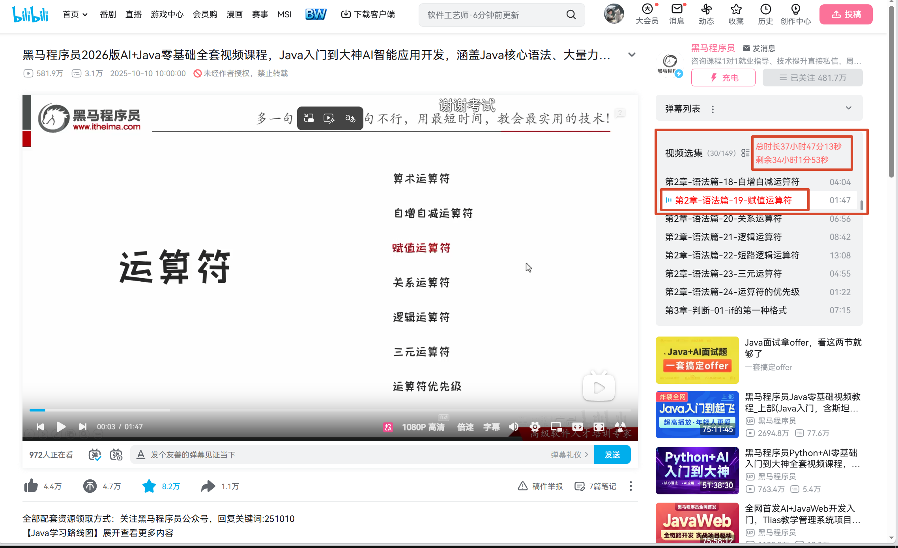

## 我用AI开发了一个B站合集视频的油猴脚本
下方是全部代码
```bash
    // ==UserScript==
    // @name         B站播放列表 - 剩余时长统计（极致优化版）
    // @namespace    http://tampermonkey.net/
    // @version      12.0
    // @description  极致性能，支持100+大列表，精准响应集数切换
    // @author       You
    // @match        https://www.bilibili.com/*
    // @grant        none
    // ==/UserScript==
    
    (() => {
        'use strict';
    
        // ---------- 配置 ----------
        const CFG = {
            DEBOUNCE_MS: 150,           // 防抖延迟（毫秒）
            INIT_DELAY_MS: 600,         // 首次更新延迟
            MAX_WAIT: 6,                // 轮询最大次数
        };
    
        // ---------- 缓存与状态 ----------
        const state = {
            // DOM 缓存
            dom: {
                list: null,
                amt: null,
                viewMode: null,
                badge: null,
            },
            // 数据缓存（避免全量重新计算）
            data: {
                durations: [],          // 每个视频的时长（秒）
                totalSec: 0,
                current: 0,             // 当前集数（从1开始）
                remainingSec: 0,
            },
            observer: null,
            timer: null,
            initialized: false,
        };
    
        // ---------- 工具函数 ----------
        const $ = (sel, ctx = document) => ctx.querySelector(sel);
        const $$ = (sel, ctx = document) => ctx.querySelectorAll(sel);
    
        const fmt = (sec) => {
            const h = Math.floor(sec / 3600);
            const m = Math.floor((sec % 3600) / 60);
            const s = Math.floor(sec % 60);
            return (h ? h + '小时' : '') + (m ? m + '分' : '') + (s ? s + '秒' : '0秒');
        };
    
        const parseEpisode = (text) => {
            const m = text.trim().match(/（(\d+)\/(\d+)）/);
            return m ? { current: +m[1], total: +m[2] } : null;
        };
    
        // ---------- 高亮样式（通过 CSS 类避免内联样式） ----------
        function ensureHighlightStyle() {
            if (document.getElementById('bili-highlight-style')) return;
            const style = document.createElement('style');
            style.id = 'bili-highlight-style';
            style.textContent = `
                .video-pod__item.active .title-txt {
                    color: red !important;
                }
            `;
            document.head.appendChild(style);
        }
    
        // ---------- 核心更新（增量更新数据，避免全量重算） ----------
        function updateStats() {
            const list = state.dom.list;
            if (!list) return;
    
            // 1. 获取当前集数（从头部提取，变化时触发更新）
            const amt = state.dom.amt || (state.dom.amt = $('.video-pod__header .amt'));
            let newCurrent = 0;
            if (amt) {
                const info = parseEpisode(amt.textContent);
                if (info) newCurrent = info.current;
            }
    
            // 2. 检查是否需要重新计算时长（列表长度变化或首次运行）
            const items = list.querySelectorAll('.video-pod__item');
            const newLength = items.length;
    
            // 如果列表长度变化，重新读取所有时长
            if (newLength !== state.data.durations.length || state.data.durations.length === 0) {
                const durations = [];
                let total = 0;
                for (let i = 0; i < newLength; i++) {
                    const durEl = items[i].querySelector('.stat-item.duration');
                    if (!durEl) continue;
                    const t = durEl.textContent.trim();
                    const parts = t.split(':').map(Number);
                    let sec = 0;
                    if (parts.length === 3) sec = parts[0] * 3600 + parts[1] * 60 + parts[2];
                    else if (parts.length === 2) sec = parts[0] * 60 + parts[1];
                    else continue;
                    durations.push(sec);
                    total += sec;
                }
                state.data.durations = durations;
                state.data.totalSec = total;
            }
    
            // 3. 计算剩余时长（仅当 current 变化或时长数据变化时重新计算）
            let newRemaining = 0;
            if (newCurrent > 0 && newCurrent < state.data.durations.length) {
                const dur = state.data.durations;
                for (let i = newCurrent; i < dur.length; i++) {
                    newRemaining += dur[i];
                }
            }
    
            // 4. 更新显示（仅当数据变化时）
            const totalChanged = state.data.totalSec !== 0 || true;
            const currentChanged = state.data.current !== newCurrent;
            const remainingChanged = state.data.remainingSec !== newRemaining;
    
            if (currentChanged || remainingChanged || totalChanged) {
                state.data.current = newCurrent;
                state.data.remainingSec = newRemaining;
    
                const viewMode = state.dom.viewMode || (state.dom.viewMode = $('.video-pod__header .view-mode'));
                if (!viewMode) return;
    
                let badge = state.dom.badge;
                if (!badge) {
                    badge = document.getElementById('bili-total-duration');
                    if (!badge) {
                        badge = document.createElement('span');
                        badge.id = 'bili-total-duration';
                        Object.assign(badge.style, {
                            color: '#ff6b6b',
                            fontSize: '14px',
                            marginLeft: '8px',
                            userSelect: 'none',
                            lineHeight: '1.6',
                            display: 'inline-block',
                            whiteSpace: 'pre-line',
                        });
                        viewMode.parentNode.insertBefore(badge, viewMode.nextSibling);
                    }
                    state.dom.badge = badge;
                }
    
                const totalText = `总时长${fmt(state.data.totalSec)}`;
                const remainingText = newRemaining > 0 ? `剩余${fmt(newRemaining)}` : '已看完 🎉';
                badge.textContent = totalText + '\n' + remainingText;
            }
        }
    
        // ---------- 防抖 ----------
        function debounce(fn, delay) {
            return (...args) => {
                clearTimeout(state.timer);
                state.timer = setTimeout(() => {
                    state.timer = null;
                    fn(...args);
                }, delay);
            };
        }
    
        const debouncedUpdate = debounce(updateStats, CFG.DEBOUNCE_MS);
    
        // ---------- 智能观察器（精确监听变化） ----------
        function setupObserver() {
            if (state.observer) {
                state.observer.disconnect();
                state.observer = null;
            }
    
            const list = state.dom.list || (state.dom.list = $('.video-pod__list'));
            if (!list) return false;
    
            const observer = new MutationObserver((mutations) => {
                let shouldUpdate = false;
                for (const mut of mutations) {
                    // 只关注实际影响数据的变化
                    if (mut.type === 'childList') {
                        // 有节点增删，必须更新
                        shouldUpdate = true;
                        break;
                    }
                    if (mut.type === 'attributes' && mut.attributeName === 'class') {
                        // class 变化（active切换） → 更新
                        shouldUpdate = true;
                        break;
                    }
                    if (mut.type === 'characterData') {
                        // 文本变化（集数数字变化） → 更新
                        const text = mut.target.textContent;
                        if (text && /\d/.test(text)) {
                            shouldUpdate = true;
                            break;
                        }
                    }
                }
                if (shouldUpdate) debouncedUpdate();
            });
    
            // 监听列表及其后代（包括 .video-pod__item）
            observer.observe(list, {
                childList: true,
                subtree: true,
                attributes: true,
                attributeFilter: ['class'],
                characterData: true,
            });
    
            // 额外监听头部集数元素（可能不在列表子树内）
            const amt = state.dom.amt || (state.dom.amt = $('.video-pod__header .amt'));
            if (amt) {
                observer.observe(amt, {
                    childList: true,
                    characterData: true,
                    subtree: true,
                });
            }
    
            state.observer = observer;
            return true;
        }
    
        // ---------- 轮询等待（列表未加载时） ----------
        function waitForList(attempt = 0) {
            if (attempt >= CFG.MAX_WAIT) return;
            const list = $('.video-pod__list');
            if (list) {
                state.dom.list = list;
                if (setupObserver()) {
                    // 首次更新使用较慢的防抖，避免刚加载时频繁触发
                    setTimeout(updateStats, CFG.INIT_DELAY_MS);
                }
            } else {
                setTimeout(() => waitForList(attempt + 1), 300);
            }
        }
    
        // ---------- 初始化 ----------
        function init() {
            if (!location.pathname.includes('/video/')) return;
            if (state.initialized) return;
            state.initialized = true;
    
            // 注入高亮样式（一次性）
            ensureHighlightStyle();
    
            // 尝试立即设置观察器
            if (!setupObserver()) {
                waitForList();
            } else {
                setTimeout(updateStats, CFG.INIT_DELAY_MS);
            }
        }
    
        // ---------- 清理 ----------
        function cleanup() {
            if (state.observer) {
                state.observer.disconnect();
                state.observer = null;
            }
            clearTimeout(state.timer);
            state.timer = null;
        }
    
        // ---------- 启动 ----------
        if (document.readyState === 'loading') {
            document.addEventListener('DOMContentLoaded', init);
        } else {
            init();
        }
    
        // 页面卸载时清理
        window.addEventListener('beforeunload', cleanup);
    
        // 暴露调试接口（可选）
        // window.__biliStats = { state, update: updateStats };
    })();
```    
## 使用效果

这个脚本当前播放集数改为红色，显示了看完所需要的时间，剩余多长时间，如果有bug可以告诉我，我在修改一下

